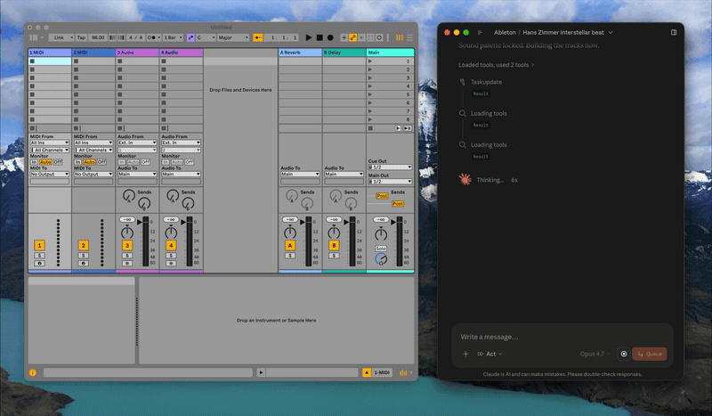
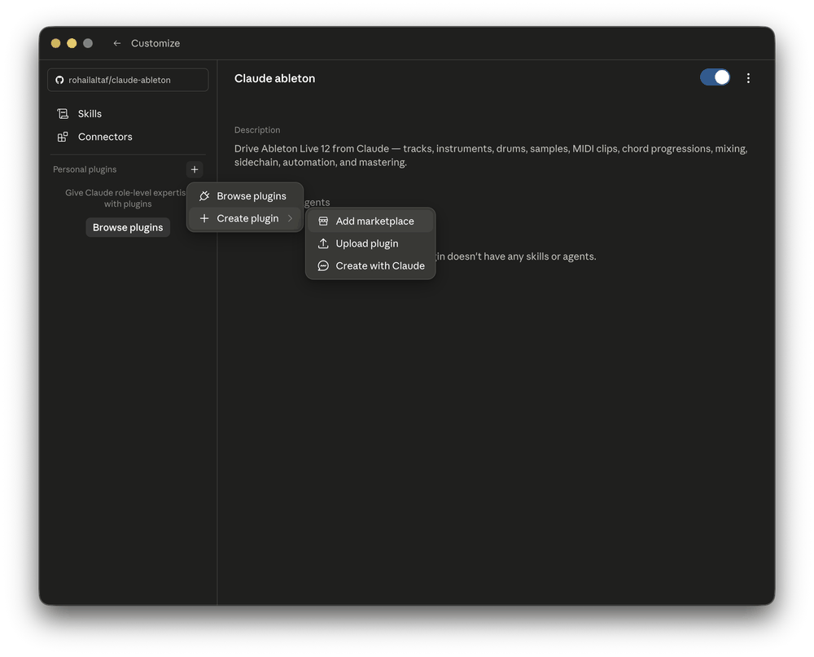

# claude-ableton

Make music in **Ableton Live 12** by talking to Claude. **claude-ableton** is a
Claude plugin that lets you create tracks, load instruments / drum kits /
samples, write MIDI clips and chord progressions, mix, route sidechains,
automate parameters, build arrangements, and master — all by chatting.

```
"Make a lo-fi beat at 82 BPM: Boom Bap drums, a warm Rhodes on
 Cmaj7 → Am7 → Dm7 → G7 with smooth voicing, a sub bass sidechained
 to the kick, and a tape-wobble auto-filter on the keys."
```

Everything materializes in your open Live set. 101 tools.



*A real session, sped way up — Claude building a track hands-free.*

---

## Requirements

- **macOS** — Windows support is planned.
- **Ableton Live 12** — Suite recommended; Intro/Standard ship fewer built-in
  instruments.
- **Claude Code** or **Claude Desktop** for the one-step plugin install — or any
  other MCP client (Cursor, Codex, …) via the manual config below.
- **Node 18+** *only* if you install via the `npx` path below. Claude Code and
  Claude Desktop bundle their own Node, so the plugin install needs nothing
  extra.

---

## Install

### Claude Code

Add the marketplace, then install:

```
/plugin marketplace add rohailaltaf/claude-ableton
/plugin install claude-ableton@claude-ableton
```

### Claude Desktop

Use Claude Desktop's **Add marketplace** feature (in its plugin settings), add
`rohailaltaf/claude-ableton`, then install the **claude-ableton** plugin.



### Cursor, Codex, or any other MCP client

Add this to your client's MCP config:

```json
{
  "mcpServers": {
    "ableton": {
      "command": "npx",
      "args": ["-y", "github:rohailaltaf/claude-ableton"]
    }
  }
}
```

---

## One-time Ableton setup

The first time it runs, the plugin installs the bundled AbletonOSC Remote Script
into your Live User Library automatically. You then enable it once:

1. Start (or restart) **Ableton Live**.
2. Open **Settings/Preferences → Link, Tempo & MIDI**.
3. Under **Control Surface**, select **AbletonOSC**. (Leave Input/Output set to
   None.)

That's it. The plugin checks the Remote Script version on every launch and
re-installs it if it changed, so you stay in sync.

---

## How it works

```
Claude (Code / Desktop / Cursor / …)
   │  MCP (stdio)
   ▼
claude-ableton  ──OSC──▶  127.0.0.1:11000  AbletonOSC Remote Script  ──▶  Live's LOM
                ◀──OSC──   127.0.0.1:11001
```

The bridge is **localhost-only** — there is no network listener and nothing is
reachable off your machine.

---

## What it can do (101 tools)

- **Tracks & instruments** — create/duplicate/delete MIDI tracks; load any
  built-in Live 12 instrument (synths, samplers, racks, Drum Synths) or a named
  preset by browser path.
- **Clips & notes** — create MIDI clips, read/add/remove notes, rename, loop,
  color, quantize, duplicate.
- **Chord progressions** — parse chord symbols and write block chords with
  **smooth voice-leading** (common tones held) or literal root position.
- **Drums & samples** — load full drum kits, inspect Drum Rack pads, drop
  samples onto pads, or load a sample onto a track (Simpler-wrapped).
- **Browser** — list instruments, drums, audio/MIDI effects, samples, packs,
  plugins, sounds, clips, Max for Live, user library, current project — and load
  from them (presets, sounds, samples, plugins/VSTs, saved racks, pack content,
  M4L devices).
- **Mixing** — volume, pan, mute, solo; device parameters; return tracks &
  sends; sidechain source/channel routing.
- **Mastering** — load effects on the Main track (Glue Compressor → Limiter),
  read/set master device params and output level.
- **Automation** — step envelopes for device and mixer parameters (volume / pan
  / sends); smooth ramps via many small steps.
- **Scenes & arrangement** — list/create/duplicate/rename/delete scenes; stamp
  Session clips onto the Arrangement timeline to build a finite track.
- **Transport & state** — play/stop/continue, fire scenes/clips, set/read
  tempo, time signature, playback position.

See [DESIGN.md](DESIGN.md) for conventions (pitch numbering, beat units, the
instrument allowlist) and design decisions.

---

## Limitations

- **Session-view authoring.** Notes and clips are written into the Session grid;
  to build a fixed track, stamp clips onto the Arrangement timeline with
  `duplicate_clip_to_arrangement` (the only LOM path to a linear arrangement).
- **Step automation only.** Smooth curves are approximated with many small
  steps — Live's API doesn't expose breakpoint curves.
- **Live API ceilings** (not exposed by Live's scripting API, so not buildable):
  grouping tracks, saving/loading/exporting the Set, importing an audio file as a
  clip (hence the Simpler workaround), loading browser clips (`.alc`) into a
  Session slot programmatically — Live's `app.browser.load_item` silently no-ops
  for clip-type browser items even with `highlighted_clip_slot` set —
  freezing/flattening, and clip follow actions (removed from the Clip API in
  Live 12).

---

## Security

This plugin grants Claude write access to your **active Ableton Live session**.
The OSC bridge is localhost-only (no network port), but treat it like any local
automation tool: review what Claude proposes before running it if you have
unsaved work. Use Live's Undo (Cmd+Z) freely.

---

## Development

```bash
git clone https://github.com/rohailaltaf/claude-ableton.git
cd claude-ableton
npm install
npm run package      # vendor the Remote Script + typecheck + bundle dist/index.js
```

- `npm run build` — bundle `src/` into a single `dist/index.js` (esbuild).
- `npm run typecheck` — `tsc --noEmit`.
- `npm run vendor` — re-vendor the pinned AbletonOSC fork into `vendor/`.
- `node scripts/integration-test.mjs` — drive all 101 tools against a running
  Live (needs OSC port 11001 free and a scratch set open).

The plugin's server is bundled into one self-contained file with no runtime
dependencies, so the committed `dist/index.js` and `vendor/AbletonOSC` run
directly when the plugin loads.

---

## License & credits

[MIT](LICENSE) © Rohail Altaf.

Built on [**AbletonOSC**](https://github.com/ideoforms/AbletonOSC) by Daniel
Jones / ideoforms (MIT) — an extended fork is bundled here; its license and
attribution are preserved in `vendor/AbletonOSC/LICENSE.md`.
